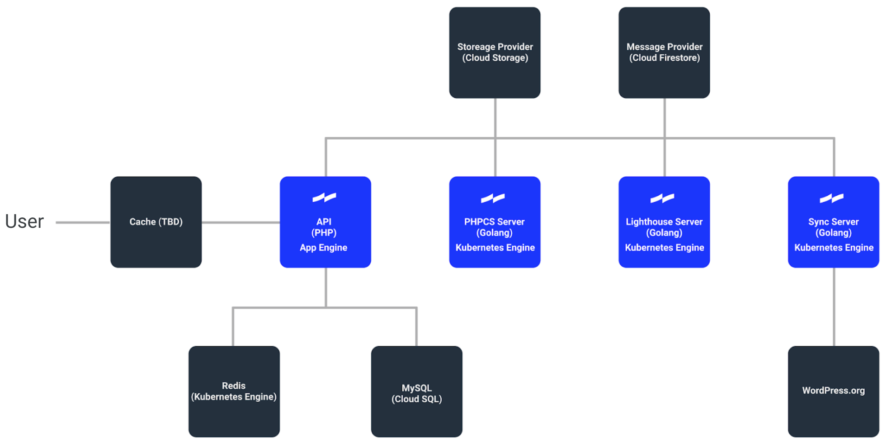

	Official Documentation
	<svg class="hero__logo" viewBox="0 0 700 233" version="1" xmlns="http://www.w3.org/2000/svg" xmlns:xlink="http://www.w3.org/1999/xlink">
		<defs>
			<path id="path0_fill" fill-rule="evenodd" d="M0 0h233v70c-49 9-84 27-116 46v49l13-8c31-18 61-34 103-43v119H0v-71c50-9 84-28 117-46V67l-11 7C74 92 44 109 0 117V0z"/>
			<path id="path1_fill" d="M45 0H19v36H0v20h19v82c0 21 10 36 38 36h22v-22H62c-13 0-17-6-17-18V56h35V36H45V0z"/>
			<path id="path2_fill" d="M30 51H4v138h26V51zM17 0C8 0 0 8 0 17s8 17 17 17 17-8 17-17S26 0 17 0z"/>
			<path id="path3_fill" d="M125 0H99v66c-8-11-21-18-39-18-36 0-60 30-60 71 0 42 23 71 59 71 14 0 30-5 40-19v18h26V0zM64 70c20 0 36 16 36 49s-15 49-36 49c-24 0-37-18-37-49s14-49 37-49z"/>
			<path id="path4_fill" d="M64 0C22 0 0 30 0 71c0 40 23 71 65 71 27 0 46-11 58-31l-21-12c-7 12-18 21-36 21-25 0-38-15-39-43h97v-6c0-40-21-71-60-71zm-1 22c20 0 33 12 34 35H27c2-22 15-35 36-35z"/>
		</defs>
		<use xlink:href="#path0_fill" fill="#1526FF"/>
		<use xlink:href="#path1_fill" transform="translate(292 37)"/>
		<use xlink:href="#path2_fill" transform="translate(386 22)"/>
		<use xlink:href="#path3_fill" transform="translate(435 22)"/>
		<use xlink:href="#path4_fill" transform="translate(576 70)"/>
	</svg>
  <canvas class="hero__canvas" id="canvas"></canvas>

## Vision

> A rising tide lifts all boats. -- United States President, John F. Kennedy (borrowed from the New England Council)

Inspired by the proverb _“A rising tide lifts all boats”_, when we lower the barrier of entry to writing and choosing quality code for enough people, it will lift the quality of code across the whole WordPress ecosystem. Tide’s vision is to make it easy to improve the quality of code throughout the WordPress ecosystem and help WordPress site owners make better choices about plugins and themes.

## Overview

Tide is an automated tool to provide insight into WordPress code and highlight areas to improve the quality of plugins and themes.

Tide services are responsible for the following:

* The Sync Server polls the WordPress.org API's for themes and plugins to process and writes them to a queue.
* The PHPCS Server reads messages from a queue and runs reports against both plugins and themes, then sends the results back to the Tide API.
* The Lighthouse Server reads messages from a queue and runs Google Lighthouse reports against the themes only, then sends the results back to the Tide API.

## Architecture diagram

The following diagram notes the Google Cloud Platform (GCP) components, Tide services components, and pending link with WordPress.org for the PHP Compatibility integration.

## Working with Tide
_[Note: This is a transition to next sections, it needs to be elaborated in more detail yet, links added, etc.]_

Tide is actively developed. Currently you can:

* [search for plugins & themes](search.md) on this site and see their audits
* install Tide locally
* install Tide and deploy it to Google Cloud Platform

In the future you will be able to use Tide as a service - use it to test your plugins or themes during development.

