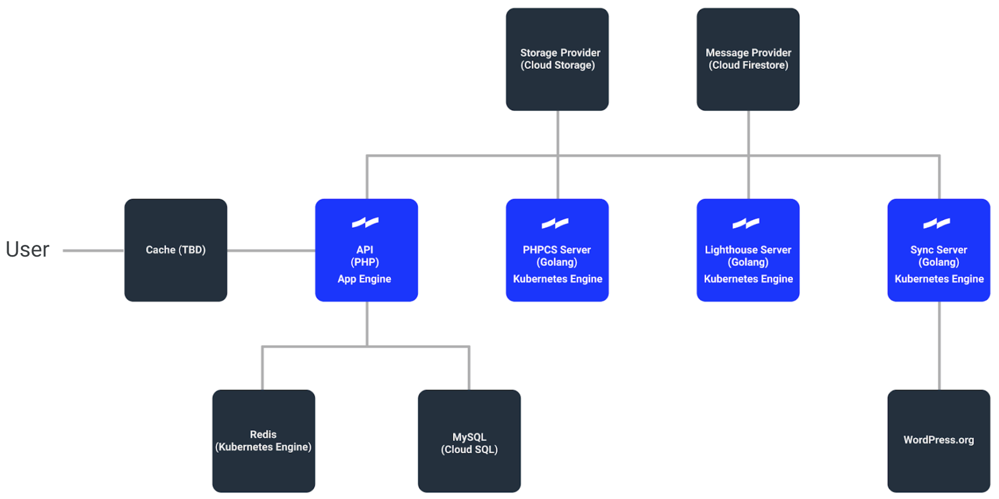

    Official Documentation
    <svg class="hero__logo" viewBox="0 0 700 233" xmlns="http://www.w3.org/2000/svg">
        <defs>
            <path id="path0_fill" fill-rule="evenodd" d="M0 0h233v70c-49 9-84 27-116 46v49l13-8c31-18 61-34 103-43v119H0v-71c50-9 84-28 117-46V67l-11 7C74 92 44 109 0 117V0z"/>
            <path id="path1_fill" d="M45 0H19v36H0v20h19v82c0 21 10 36 38 36h22v-22H62c-13 0-17-6-17-18V56h35V36H45V0z"/>
            <path id="path2_fill" d="M30 51H4v138h26V51zM17 0C8 0 0 8 0 17s8 17 17 17 17-8 17-17S26 0 17 0z"/>
            <path id="path3_fill" d="M125 0H99v66c-8-11-21-18-39-18-36 0-60 30-60 71 0 42 23 71 59 71 14 0 30-5 40-19v18h26V0zM64 70c20 0 36 16 36 49s-15 49-36 49c-24 0-37-18-37-49s14-49 37-49z"/>
            <path id="path4_fill" d="M64 0C22 0 0 30 0 71c0 40 23 71 65 71 27 0 46-11 58-31l-21-12c-7 12-18 21-36 21-25 0-38-15-39-43h97v-6c0-40-21-71-60-71zm-1 22c20 0 33 12 34 35H27c2-22 15-35 36-35z"/>
        </defs>
        <use xlink:href="#path0_fill" fill="#1526FF"/>
        <use xlink:href="#path1_fill" transform="translate(292 37)"/>
        <use xlink:href="#path2_fill" transform="translate(386 22)"/>
        <use xlink:href="#path3_fill" transform="translate(435 22)"/>
        <use xlink:href="#path4_fill" transform="translate(576 70)"/>
    </svg>
    <canvas class="hero__canvas" id="canvas"></canvas>

    

## Vision

> A rising tide lifts all boats. -- United States President, John F. Kennedy (borrowed from the New England Council)

Inspired by the proverb _"A rising tide lifts all boats"_, we want to lift the quality of code across the whole WordPress ecosystem. **Tide’s vision is to run automated quality testing for all WordPress plugins and themes and make those test results visible for both the authors and the end users of those plugins and themes.** This will help improve the quality of code throughout the WordPress ecosystem and help WordPress site owners make better choices about plugins and themes.

## Current status

The Tide project is an [official component of the WordPress project](https://make.wordpress.org/tide/) and still in the early stages. Today, Tide scans all WordPress plugins and themes and provides scan results as JSON through the Tide API.

The next step is to start using the JSON output in the WordPress plugin and theme repository to show PHP compatibility information. This will help drive the adoption of the newest PHP versions as both plugin/theme authors and WordPress site owners installing those plugins and themes will be more aware of the PHP compatibility of each plugin/theme.

Progress can be followed in the WordPress meta issue tracker at https://meta.trac.wordpress.org/ticket/4309.

## Technical overview

Tide services are responsible for the following:

* The [Sync Server](services/sync-server.md) polls the WordPress.org API's for themes and plugins to process and writes them to a queue.
* The [PHPCS Server](services/phpcs-server.md) reads messages from a queue and runs reports against both plugins and themes, then sends the results back to the Tide API.
* The [Lighthouse Server](services/lighthouse-server.md) reads messages from a queue and runs Google Lighthouse reports against the themes only, then sends the results back to the Tide API.
* The [wptide.org](https://wptide.org) website includes both the documentation you are reading and also serves the JSON API endpoints from where the reports can be queried. Visit https://wptide.org/search to see examples of JSON reports.

In addition, we are working on the meta repository of WordPress.org to handle fetching the reports generated by Tide and showing summaries of them in the WordPress.org plugin and theme directories.

You can also run your own Tide instance and do your own customized reports if you are for example a hosting company that wants to use this technology for custom testing and quality assurance.

### Architecture diagram

The following diagram notes which Google Cloud Platform (GCP) components are used to represent the four Tide services, and how the themes and plugins API on WP.org connects to the Sync Server. The basic flow is that a User or an API Client will make a request to the Tide REST API, which sends back a response. The request could create messages in the queue where one or more services process them by running automated scripts and witting the results back to the API. Additionally, the Sync Server will poll the WP.org API's for new themes and plugins to add to the message queue.

Git repositories:
- The sync, PHPCS and Lighthouse servers: https://github.com/wptide/wptide
- Go packages used by the servers: https://github.com/wptide/pkg
- API: https://github.com/wptide/wp-tide-api

You can contribute to this documentation at https://github.com/wptide/docs.

### WordPress.org components

* [Tide syncer](https://meta.trac.wordpress.org/browser/sites/trunk/wordpress.org/public_html/wp-content/plugins/plugin-directory/jobs/class-tide-sync.php) that fetches the reports
* [Plugin widget](https://meta.trac.wordpress.org/browser/sites/trunk/wordpress.org/public_html/wp-content/plugins/plugin-directory/widgets/class-meta.php) where the information will be publicly visible

## Working with Tide

Currently, you can:

* [Search for plugins & themes](search.md) and view their audit reports in this documentation.
* [Install](installation/index.md) Tide to help test and develop locally.
* Deploy Tide to [Google Cloud Platform](gcp/index.md) and run your own variation of Tide in the cloud.

In the future, you will be able to use Tide as a service to test your plugins or themes during development.

## Contributing

There are many ways to contribute to Tide. You can help us champion the adoption of the quality testing results in the WordPress project. You can also help by contributing code or documentation to Tide itself.

Please read our [Contributing](contributing.md) guide for details on the process of creating a ticket or submitting a pull request to Tide, and our [Code of Conduct](code-of-conduct.md).

## Maintainers

[Derek Herman (@valendesigns)](https://github.com/valendesigns), and
[Jeffrey Paul (@jeffpaul)](https://github.com/jeffpaul)

## Contributors

Props: [Bartek Makoś (@MakiBM)](https://github.com/MakiBM),
[Brendan Woods (@brendanwoods-xwp)](https://github.com/brendanwoods-xwp),
[Cathi Bosco (@cathibosco)](https://github.com/cathibosco),
[Daniel Louw (@danlouw)](https://github.com/danlouw),
[David Cramer (@davidcramer)](https://github.com/davidcramer),
[David Lonjon (@davidlonjon)](https://github.com/davidlonjon),
[Derek Herman (@valendesigns)](https://github.com/valendesigns),
[Dušan D. Majkić (@dmajkic)](https://github.com/dmajkic),
[Janki Moradiya (@jankimoradiya)](https://github.com/jankimoradiya),
[Jeffrey Paul (@jeffpaul)](https://github.com/jeffpaul),
[Jonathan Wold (@sirjonathan)](https://github.com/sirjonathan),
[Joshua Wold (@jwold)](https://github.com/jwold),
[Justin Kopepasah (@kopepasah)](https://github.com/kopepasah),
[Keanan Koppenhaver (@kkoppenhaver)](https://github.com/kkoppenhaver),
[Leo Postovoit (@postphotos)](https://github.com/postphotos),
[Lubos Kmetko (@luboskmetko)](https://github.com/luboskmetko),
[Luke Carbis (@lukecarbis)](https://github.com/lukecarbis),
[Meet Makadia (@mrmakadia94)](https://github.com/mrmakadia94),
[Miina Sikk (@miina)](https://github.com/miina),
[Mike Crantea (@mehigh)](https://github.com/mehigh),
[Otto Kekäläinen (@ottok)](https://github.com/ottok),
[Pierre Gordon (@pierlon)](https://github.com/pierlon),
[Scott Reilly (@coffee2code)](https://github.com/coffee2code),
[Rheinard Korf (@rheinardkorf)](https://github.com/rheinardkorf),
[Rob Stinson (@robstino)](https://github.com/robstino),
[Sayed Taqui (@sayedtaqui)](https://github.com/sayedtaqui),
[Ulrich Pogson (@grappler)](https://github.com/grappler),
[Utkarsh Patel (@PatelUtkarsh)](https://github.com/PatelUtkarsh)

## Contact Us

Have questions? Join us in the [`#tide` channel](https://wordpress.slack.com/messages/C7TK8FBUJ/) in [WordPress Slack](https://make.wordpress.org/chat/). If you're new to Slack, keep in mind that it sometimes takes several hours for community members to respond — thank you for being patient!
