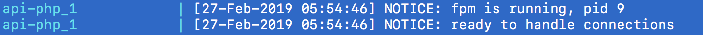
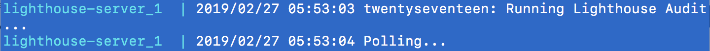
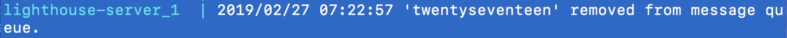
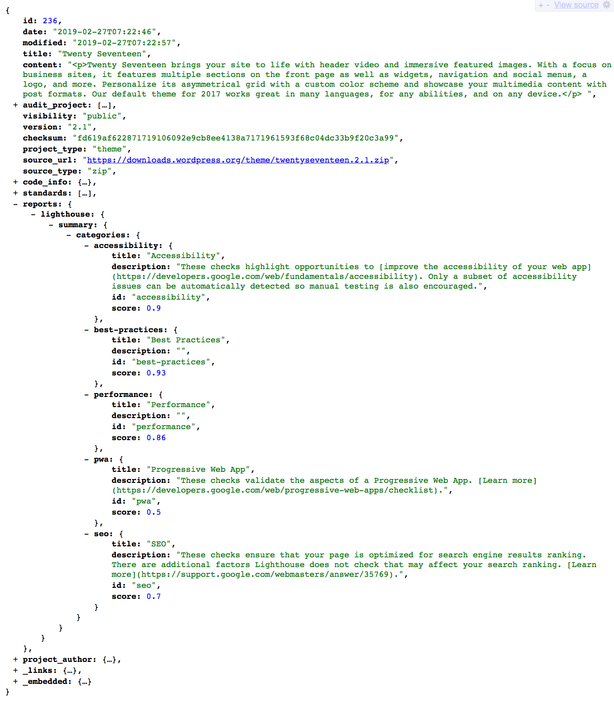
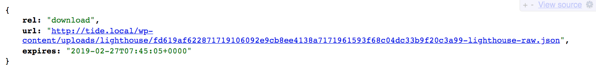

# Lighthouse Server

The Lighthouse Server is a Go binary installed on an Alpine Linux Docker image that reads messages from a queue and runs Google Lighthouse reports against themes, then sends the results back to the Tide API.

It is important to note that the server only works for wp.org themes and the most recent version of it. This means that in a headless instance of Chromium the Lighthouse CLI audits each theme by loading the demo version found on wp-themes.com, which is always the latest version so if you request a theme audit for a previous version the results will be for the latest one. Eventually, we will look into a way to load the theme into the container and audit any version on request.

## Environment Variables

| Variable | Description |
| :--- | :--- |
| `LH_CONCURRENT_AUDITS` | Sets the number of goroutines the server will perform concurrently. Default is `5`. _This is currently deactivated and will have no impact during runtime._ |
| `LH_MESSAGE_PROVIDER` | Queue audit messages using the local MongoDB, Google Cloud Firestore, or AWS SQS. Must be one of: `local`, `firestore`, `sqs`. Default is `local`. |
| `LH_STORAGE_PROVIDER` | Upload reports to the local file system, Google Cloud Storage, or AWS S3. Must be one of: `local`, `gcs`, `s3`. Default is `local`. |
| `LH_TEMP_FOLDER` | Sets the temporary folder inside the container used to store downloaded files. Default is `/tmp`. |

## Commands

| Command | Description |
| :--- | :--- |
| `make lighthouse.build.bin` | Build the Lighthouse Server Go binary. |
| `make lighthouse.clean.bin` | Clean the Lighthouse Server Go binary. |
| `make lighthouse.build.image` | Build the Lighthouse Server Docker image. |
| `make lighthouse.build.up` | Rebuild the Lighthouse Server Docker image and run the container in isolation with docker-compose up. |
| `make lighthouse.up` | Run the Lighthouse Server Docker image in isolation with docker-compose up. |
| `make lighthouse.down` | Take the isolated Lighthouse Server Docker container down. |
| `make lighthouse.stop` | Stop the isolated Lighthouse Server Docker container with docker-compose stop. |
| `make lighthouse.rm` | Remove the stopped Lighthouse Server Docker container with docker-compose rm. |
| `make lighthouse.push.image` | Push the Lighthouse Server Docker image to GCR. |
| `make lighthouse.clean.image` | Clean the Lighthouse Server Docker image from the host machine. |
| `make lighthouse.build.cluster` | Build the Lighthouse Server GKE cluster. |
| `make lighthouse.creds` | Get the Lighthouse Server GKE cluster credentials. |
| `make lighthouse.tpl` | Generate the Lighthouse Server GKE YAML template. |
| `make lighthouse.deploy.cluster` | Deploy the Lighthouse Server GKE cluster. |
| `make lighthouse.get.cluster` | Get the Lighthouse Server GKE cluster status. |
| `make lighthouse.clean.cluster` | Clean the Lighthouse Server GKE cluster. |

## Running audits

This section described the components included in the Lighthouse integration with Tide, demonstrates the Lighthouse audit process, and provides example Tide API audit results.

### Components

The following outlines the components needed to integrate Lighthouse auditing of WordPress themes into the Tide API.

1. Docker Container `lighthouse-server`
   - Chromium
   - Lighthouse CLI
   - Lighthouse Server Go binary
2. Lighthouse Server Source Code
   - `bin/lighthouse-server` built Lighthouse Server Go binary.
   - `cmd/lighthouse-server` Lighthouse Server Go source code.
   - `service/lighthouse-server` `make` , Docker, and Kubernetes configurations.
   - `vendor` imported Go dependencies.

### Process

The following demonstrates how a WordPress theme is run through a Lighthouse audit and has its results stored and returned via the Tide API.

1. The Tide API starts and listens for requests.

1. The Lighthouse Server starts and attempts to authenticate with the Tide API.

1. The Tide API receives an authentication request from the Lighthouse Server.

1. The Lighthouse Server is authenticated and starts polling the message queue.

1. The theme is downloaded and a checksum is calculated.

1. The source code is ran through `gocloc` to get code information.

1. The source is scanned for the Theme header information.

1. Runs the theme preview URL (`https://wp-themes.com/<theme-slug>`) through a `lighthouse` audit and keeps polling for the next job.

1. Uploads the raw report to a storage provider (GCS, S3, or local) and generates a summary report.

1. The Lighthouse Server bundles the summary report and reference to the raw report as a message payload and sends the payload to the Tide API.

1. The Tide API updates the audit endpoint after receiving the `POST` request from the Lighthouse Server.

1. Finally the message is removed from the queue.

### Reports

The following is a Tide API audit object showing a Lighthouse summary report.

#### `http://tide.local/api/tide/v1/audit/wporg/theme/twentyseventeen/2.1`

The following is a Tide API report object showing a download link to the original Lighthouse report. This demonstrates the local disk storage, a cloud provider will look a bit different and the URL will expire.

#### `http://tide.local/api/tide/v1/report/236/raw/lighthouse`

